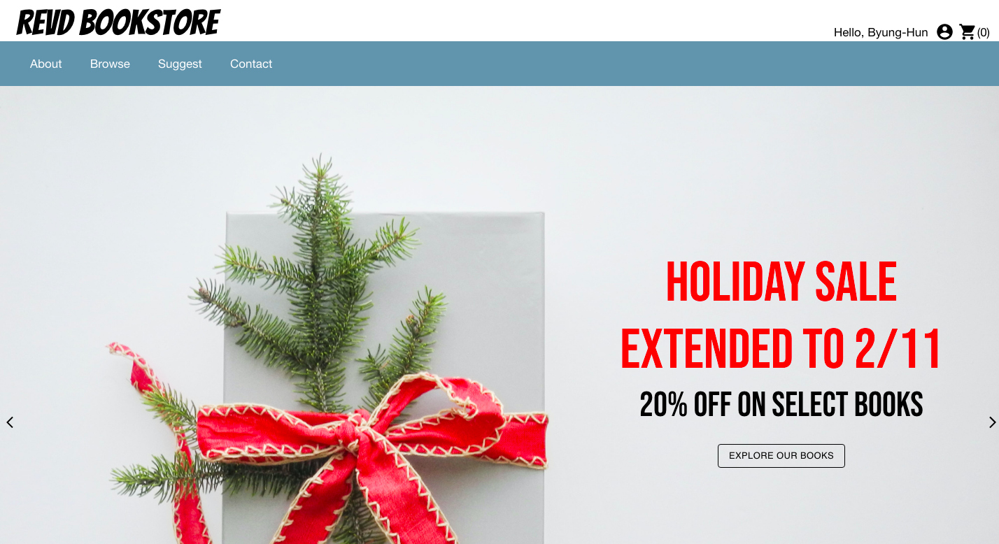
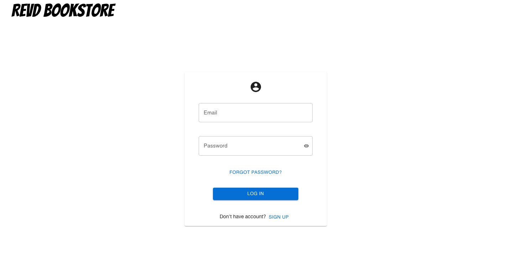
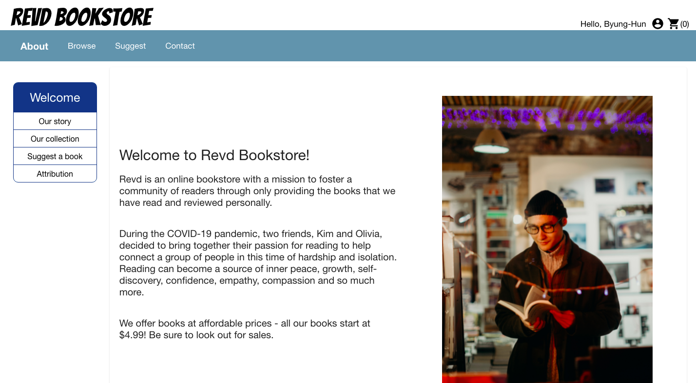
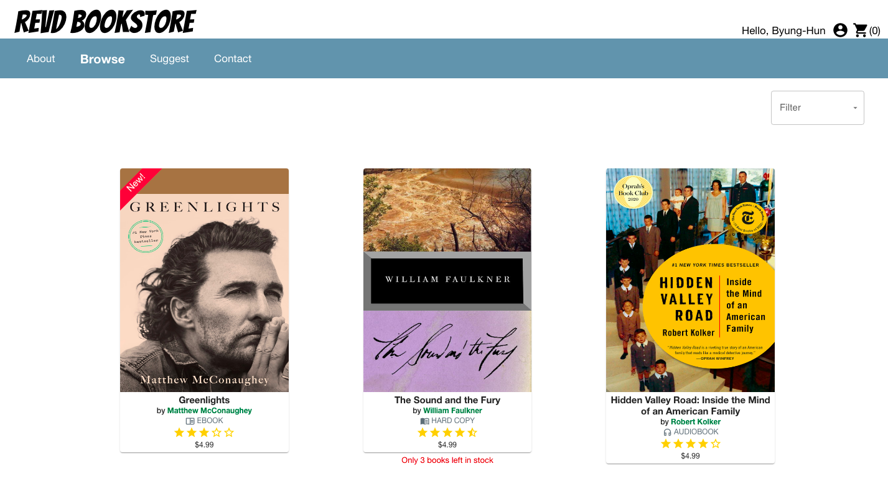
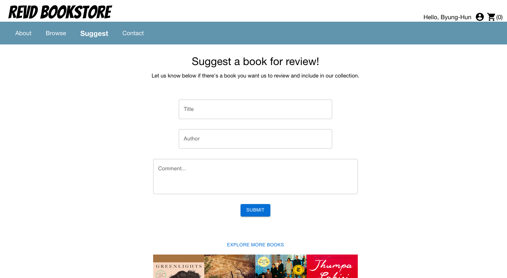
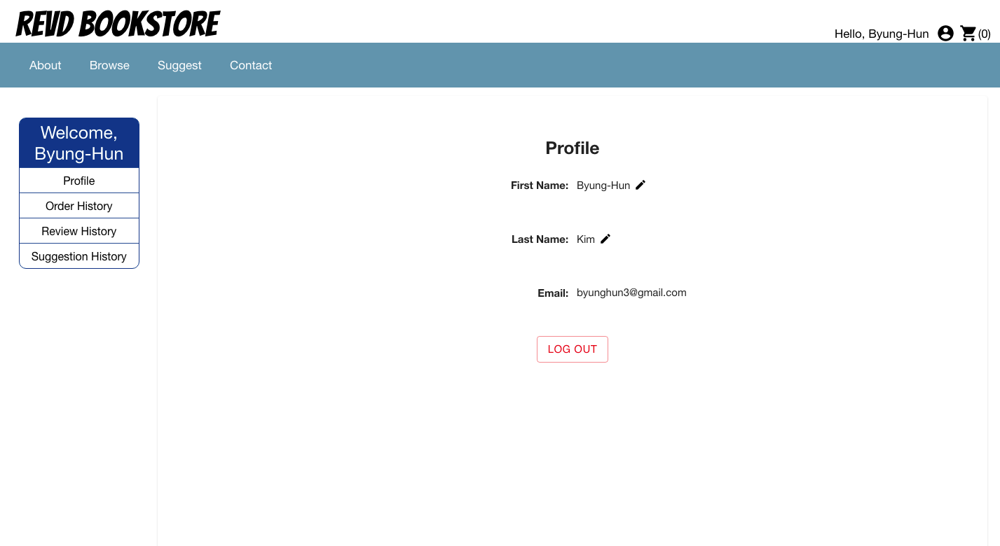

# Revd Bookstore

This app serves as the website for an imaginary small-scale online bookstore that carries only the books the owners have personally read and reviewed.

## Live Demo

https://byunghun3.github.io/revd-bookstore/

## Technologies

This project was created with:

- React.js
- Typescript
- CSS Modules
- Styled-components
- Material UI
- ESLint

## Usage

You can either use the default account below or sign up with a new account to access all functions of the website.

**Username**: byunghun3@gmail.com

**Password**: byunghun3

The home page contains a nav bar for links to the other pages in the website. 

In the top right corner, the account icon takes you to the login or the profile page, depending on the login status. The cart icon takes you to the cart for review and check out.

The body includes a slider for announcements and advertisements for Revd Bookstore.

The footer includes links to social media and terms and condtions policy.

The login page contains a form to login with an existing account, a link to "sign up" form, and a link to "forgot password" form.

The About page introduces the story and goal behind Revd Bookstore.

The page also explains the way the collection rotates and the way the suggest form works.

At the bottom, there is an attribution link to see credits to the icons or images used for the site.

The Browse page displays the current books in the collection. You can use the filter to show books by type (ebook, audiobook, hard copy) or genre (nonfiction, fiction).

When you hover over each book, two action icons appear. The glass icon takes you to each product page containing book details, review from Revd, and reviews from other customers. The cart icon adds the book to the cart.

The Suggest page contains a form where you can submit suggestions for a book you want to see Revd Bookstore add to the rotating collection. 

The profile page can only be accessed after login. 

The page allows you to edit your first and last name and see your order, review, and suggestion history.

## Reflection

My goal for this project was to build a multi-page e-commerce site with products and login.

As with the Golf Course Weather project, I used my hobby for reading as a starting point to build a site around books that I've read as the products. I started keeping a reading log since the start of the COVID pandemic, so I already material for book reviews.

It was a challenge to code with React functional components and Typescript for the first time. In the beginning, it took a bit of time to get used to figuring out which issue came from React or Typescript. 

I found that writing hooks over classes made the code more intuitive, look simpler, and easier to maintain/fix. useContext became an integral part as I used the React context API to handle sign up/login. I thought about using a back end for a more secure login authentication, but I decided that I wanted to see whether I could get it working using just the context API, instead of trying to learn too many new technologies in one project.

Typescript helped me to really think about what type of value I wanted to use for each variable and to keep variables consistent throughout all the components and pages. For example, it saved me time in the long run to declare each book's price as a number instead of as a string with the dollar sign, because it was easier to add in the feature for showing and calculating the sale price later.

I used CSS modules to try out a new way of styling CSS. In the Golf Course Weather app, I noticed how the styles crossed over between components before I migrated the CSS to SCSS. I liked that I didn't have to worry about the cross over, but it did feel like the style codes were all over the place with there being a separate module.css files and MUI styled components also being directly in the .tsx files. 

Because I didn't know much about responsive design at the start of this project, I left it until the end to return to each component and page to update numbers and units, and add in media queries. Even though it was a slow process, updating all at once at the end was probably the better way for me to test and understand how to implement responsiveness to my app for the first time. 

There were other technologies/techniques that I used for the first time to help me expand my knowledge and appreciation for what I can achieve with React: React Router v6, styled-components, MUI, ESLint, and a few NPM packages.

The biggest lesson I learned from this project is how to approach bug fixes. Because of the extensive size of the website (at least for me at the time), there were many times when a component would break when I coded a new one. I learned to research multiple resources (look at both written posts and tutorial videos), try console logging at different stages of component render, inspect elements on Chrome DevTools, search/try for similar problems (ex. test with similar array methods, similar MUI components), and really read carefully what the error message says, etc. I feel proud and grateful to have finished this project, as this experience will give me the confidence to tackle more advanced coding projects and challenges moving forward.

For future e-commerce projects, I want to learn more about and implement better SEO and accessibility, a robust backend for data storage, a more secure login authentication, and speed optimization to accommodate scalability.
